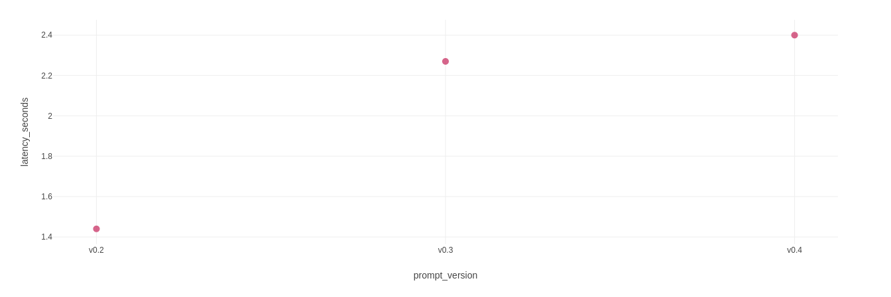

# Prompt Experimentation Summary

This experiment evaluates three system prompt variants against a fixed Git diff to determine the optimal balance between code review quality and pipeline efficiency (latency, token consumption).

## 📊 Quick Comparison Matrix

| Version | Tone & Persona | Core Focus Areas | Expected Impact on Metrics |
| :--- | :--- | :--- | :--- |
| **v0.2** (Auditor) | Strict, Cold & Critical | Security, performance, and deep edge cases | Shorter output length, lower token usage, and minimal latency. |
| **v0.3** (Mentor) | Empathetic & Educational | Clean code, readability, and explaining the "Why" | Higher output token count, longer text, and increased latency. |
| **v0.4** (Experimental) | Structural Variant | Output format compliance & token density | High structure adherence with baseline metrics. |

## 📝 Experiment Description

* **v0.2 (Hardcore Auditor):** Adopted the persona of a strict Senior Principal Engineer. It eliminated all conversational fluff, focusing purely on hunting down critical bugs, security vulnerabilities, and architectural flaws.
* **v0.3 (Engineering Mentor):** Functioned as an empathetic clean code advocate. Rather than just listing errors, it focused on developer growth by explaining the engineering principles behind each piece of feedback.
* **v0.4 (Structural Variant):** Acted as an experimental baseline focused on rigid output format constraints to measure compliance versus token density.

## 📉 Visualizations with Scatter Plot (Prompt Version & Latency Seconds)

## 📊 Empirical Evidence (MLflow UI Comparison)

The following metrics were captured directly from the MLflow Tracking Server comparison view, analyzing the same LLM model engine (`llama-3.3-70b-versatile`) over a fixed input diff (`diff_size_chars: 572`).

| Metric | Run 1 (`v0.2` - Auditor) | Run 2 (`v0.3` - Mentor) | Run 3 (`v0.4` - Variant) |
| :--- | :--- | :--- | :--- |
| **Run ID** | `a5378686eea742d389ce6ae5a0a5eab3` | `a37b5d69f2f54e5598f26c25b27e401b` | `3a696df9fcd44a66bdd21873618a82e3` |
| **Run Name** | `nosy-crow-669` | `carefree-worm-829` | `resilient-ray-510` |
| **Total Duration** | **5.7s** 🏆 (Fastest) | 6.5s | 6.6s |
| **LLM Latency** | **1.44s** 🏆 (Lowest) | 2.27s | 2.4s |
| **Token Count Input** | 576 | **537** 🏆 (Lowest) | 549 |

---

## 🔍 Key Observations & MLOps Insights

* **Latency & Execution Speed:** The **Auditor persona (`v0.2`)** is the absolute winner regarding performance, cutting latency down to **1.44 seconds** and total job duration to **5.7 seconds**. This proves that instructing the model to avoid fluff and conversational language natively decreases inference time.
* **Input Token Optimization:** The **Mentor persona (`v0.3`)** managed to compress the instruction size slightly better, consuming only **537 input tokens**. However, due to its educational nature, it leads to a higher reasoning/output cost, inflating the latency by **~57%** compared to `v0.2`.
* **Experiment Control:** The `diff_size_chars` parameter remained fixed at exactly **572** across all runs, validating that our experiment isolated the system prompt as the single independent variable.

## 🏆 Final Pipeline Recommendation

* **Production Pipeline (Default):** Implement **`v0.2` (Auditor)**. Saving nearly a second of execution time per automated code review significantly lowers CI/CD compute costs and speeds up Pull Request iterations.
* **Alternative Use Case:** Use **`v0.3` (Mentor)** specifically for onboarding repositories where developer education outweighs raw speed performance.