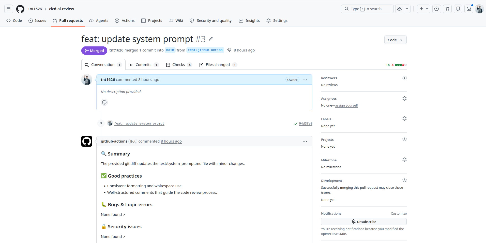
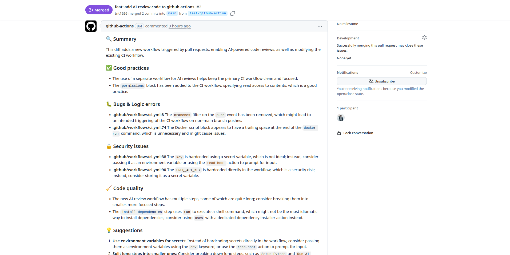
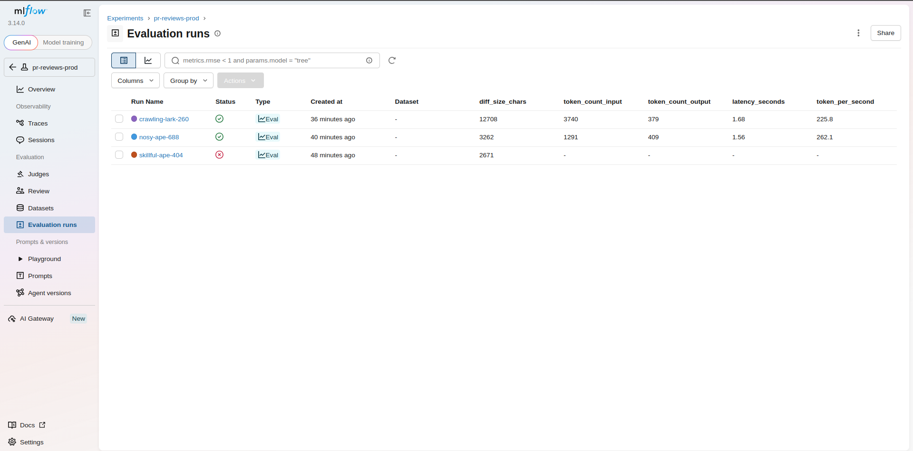
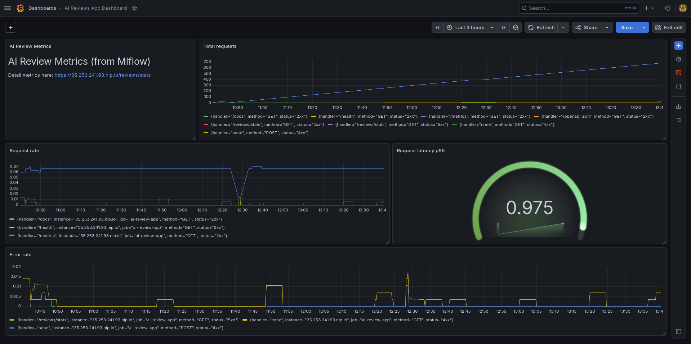

# cicd-ai-review

A GitHub Actions pipeline that automatically tests, builds a Docker image, deploys to a GCP VM, and posts an AI-powered code review comment on every Pull Request using Llama 3 via Groq — with every review run tracked and versioned through a self-hosted MLflow server.

---

## Stack

| Layer               | Tool                                   |
|---------------------|----------------------------------------|
| API                 | FastAPI + Python 3.13                  |
| Test                | pytest + httpx                         |
| Container           | Docker + Docker Hub                    |
| CI/CD               | GitHub Actions                         |
| AI                  | Groq API (Llama-3.3-70b-versatile)     |
| Experiment Tracking | MLflow 3.x (self-hosted on GCP VM)     |
| Prompt Versioning   | MLflow Prompt Registry                 |
| Server              | GCP e2-medium + Nginx + HTTPS (nip.io) |
| Monitoring          | Prometheus + Grafana                   |

---

## Architecture



**Two independent flows run on every event:**

**Flow A — Pull Request:** When a PR is opened, the `ai-review` job generates a git diff, sends it to Llama 3 via Groq, logs the run to MLflow, and posts the review as a PR comment via the GitHub API.

**Flow B — Push to main:** When code is merged, the pipeline runs tests → builds and pushes a Docker image to Docker Hub → SSHs into the GCP VM and redeploys the container.

---

## How it works

### AI Code Review Bot

Every time you open a Pull Request:

1. GitHub Actions checks out the branch with full history
2. Generates a diff: `git diff origin/main...HEAD`
3. Loads the current production system prompt from the MLflow Prompt Registry
4. Sends the diff to Llama 3 (via Groq API) with that prompt
5. Logs the run (params, metrics, output) to MLflow
6. Posts the review as a comment on the PR via the GitHub Issues API

The review follows a fixed format — summary, good practices, bugs, security issues, code quality, and optional suggestions.

*PR with bot comment triggered:*


*Full review — bugs, security, suggestions with file:line references:*


### CI/CD Pipeline

```
push to main
    │
    ├── test job       → pytest (Python 3.12, 3.13 matrix)
    │
    ├── build job      → docker build + push to Docker Hub (tagged with commit SHA)
    │
    └── deploy job     → SSH into GCP VM → docker pull → docker run
```

---

## MLflow Experiment Tracking

Every AI review run is logged to a self-hosted MLflow server, tracking model name, prompt version, token usage, latency, and pass/fail status. This turns "is the AI bot working well?" from a guess into a question you can answer with data.

- **Server:** self-hosted via Docker on the GCP VM, behind Nginx + HTTPS
- **Experiments:** separated by environment — `pr-reviews-dev` (local runs) and `pr-reviews-prod` (CI/CD runs)
- **Per-run data:** model name, prompt version, diff size, input/output token counts, latency, tokens/sec, and a `status` tag (`success` / `failed`)
- **Artifacts:** the exact system prompt, input diff, and review output are stored per run for full reproducibility
- **Stats endpoint:** `GET /reviews/stats` aggregates total reviews, average latency, average token usage, and most-used model directly from MLflow — no separate database needed

*MLflow UI showing tracked runs for `pr-reviews-prod`:*


### Comparing prompt versions

Three system prompt personas were tested against the same diff to compare review quality against latency and token cost — see [`PROMPT_EXPERIMENTS.md`](PROMPT_EXPERIMENTS.md) for the full writeup with MLflow comparison data.

---

## Prompt Registry & Versioning

System prompts are version-controlled using MLflow's **Prompt Registry** — a separate system from the Model Registry, purpose-built for text templates rather than ML model artifacts.

## Monitoring with Prometheus + Grafana

The FastAPI server exposes Prometheus-compatible metrics at `/metrics`
via `prometheus-fastapi-instrumentator`, scraped every 15 seconds over
HTTPS by a Prometheus instance.

**Design decision — why review-specific metrics live in MLflow, not Prometheus:**
`review.py` runs as a short-lived CLI process inside GitHub Actions —
it exits within seconds of finishing a review. Prometheus's pull model
requires scraping a persistent `/metrics` endpoint at fixed intervals,
so any custom metric defined inside that short-lived process would be
invisible by the next scrape. Instead:

- **Prometheus + Grafana** monitor what they can reliably observe — the
  long-running FastAPI server (`/health`, `/reviews/stats`): request
  rate, latency (p95), and error rate.
- **MLflow** tracks everything review-specific (latency, token usage,
  prompt version) per run, with no scrape-timing constraint.

The dashboard links directly to `GET /reviews/stats` for review-specific
numbers, rather than forcing both systems to track the same thing twice.

*Grafana dashboard — request volume, latency, and error rate:*


Dashboard definition stored as code: [`grafana/dashboard.json`](grafana/dashboard.json)

### How it works

Each time the bot runs, the current system prompt is registered as a new version in MLflow (MLflow only creates a new version if the content actually changed):

```python
prompt = mlflow.genai.register_prompt(
    name="ai-review-prompt",
    template=system_prompt,
    commit_message="Auditor persona, strict tone",
)
```

The bot always loads whichever version is tagged with the `production` alias — not directly from a local `.md` file:

```python
loaded = mlflow.genai.load_prompt("prompts:/ai-review-prompt@production")
system_prompt = loaded.template
```

### Promoting a new prompt version

1. Edit `text/system_prompt.md` with the new prompt content
2. Run the bot once — this registers a new version automatically
3. Check the new version number in the MLflow UI → **Prompts** tab
4. Promote it to production:

```bash
uv run src/promote_prompt.py <version_number>
```

5. The bot uses the new version on its very next run — no code changes, no redeploy required.

### Why this matters

- Prompt changes are versioned and auditable, just like code
- Rolling back is instant — just re-promote an older version's alias
- A/B testing prompt variants is straightforward: compare run metrics grouped by `prompt_version` in MLflow (see `PROMPT_EXPERIMENTS.md`)

---

## How to run locally

**Prerequisites:** Python 3.13, `uv`, Docker, a Groq API key, access to an MLflow tracking server (or run one locally — see below)

```bash
# 1. Clone the repo
git clone https://github.com/tnt1626/cicd-ai-review.git
cd cicd-ai-review

# 2. Install dependencies
uv sync

# 3. Set environment variables
cp .env.example .env
# Fill in GROQ_API_KEY and MLFLOW_TRACKING_URI in .env

# 4. (Optional) Run MLflow locally instead of using a remote server
mlflow server --host 0.0.0.0 --port 5001

# 5. Run the app
uv run uvicorn src.main:app --reload

# 6. Run tests
uv run pytest

# 7. Test the AI review script locally
git diff main | uv run -m src.review --pr-number 1 --repo your-username/cicd-ai-review

# 8. Check aggregated review stats
curl http://localhost:8000/reviews/stats
```

---

## GitHub Secrets setup

Go to your repo → **Settings → Secrets and variables → Actions → New repository secret**

| Secret | How to get it |
|---|---|
| `GROQ_API_KEY` | [console.groq.com](https://console.groq.com) → API Keys |
| `GITHUB_TOKEN` | Auto-injected by GitHub Actions — no setup needed |
| `DOCKERHUB_USERNAME` | Your Docker Hub username (set as a **variable**, not secret) |
| `DOCKERHUB_TOKEN` | Docker Hub → Account Settings → Security → Access Tokens |
| `VPS_HOST` | External IP of your GCP VM (Compute Engine → VM Instances) |
| `VPS_KEY` | SSH private key — run `ssh-keygen -t ed25519 -C "gcp-deploy"` locally, paste the private key here |
| `MLFLOW_TRACKING_URI` | HTTPS URL of your MLflow server (e.g. `https://mlflow.your-vm-ip.nip.io`) |

---

## What I learned

This started as a 2-week project built from scratch as a beginner to DevOps, then expanded into a 90-day MLOps roadmap covering experiment tracking and prompt management.

- **Docker** — Dockerfile, Docker Hub, image tagging, container lifecycle, running multi-service setups on a single resource-constrained VM
- **GitHub Actions** — multi-job pipelines, secrets, matrix strategy, conditional jobs
- **Linux server administration** — UFW firewall, user management, SSH keys, debugging OOM crashes and resizing VMs under load
- **Networking** — reverse proxy with Nginx, HTTPS with Certbot/Let's Encrypt, diagnosing Host header / DNS rebinding protections on self-hosted services
- **Cloud infrastructure** — provisioning and configuring a GCP VM, reserving a static IP, upgrading machine types under real memory pressure
- **AI integration** — Groq API, prompt engineering, GitHub REST API for automated comments
- **MLOps fundamentals** — experiment tracking with MLflow, the distinction between Model Registry and Prompt Registry, alias-based deployment workflows (vs. the now-deprecated Stages API), and using tracked metrics to make data-driven prompt decisions
- **Observability** — Prometheus pull-model constraints, Grafana dashboards as code, and recognizing when two monitoring systems should stay separate rather than be forced to overlap
---

## Possible extensions

- [x] Prometheus + Grafana — real-time monitoring and alerting (Phase 2)
- [ ] Terraform + Ansible — provision infrastructure as code instead of manual setup (Phase 3)
- [ ] Webhook server — support any repo without GitHub Actions setup
- [ ] Web dashboard — view review history and stats with a proper UI
- [ ] Kubernetes — replace `docker run` / `docker compose` with a k8s deployment